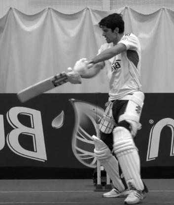

# JU-Cricket: A Benchmark Dataset for Fine-grained Cricket Action Classification with Challenging Visual Conditions

## 📌 Overview
JU-Cricket is a large-scale benchmark dataset and experimental framework designed for **fine-grained cricket action classification under realistic visual conditions**. Unlike existing datasets, JU-Cricket focuses on **real-world deployment challenges**, including visual distortions commonly present in broadcast footage such as motion blur, noise, and low resolution.

---

## ❗ Problem Statement
Cricket action recognition is challenging due to:
- High **visual similarity between actions**
- **Single-frame decision moments**
- Real-world **visual distortions**

---

## 🚀 Key Contributions
- **15,728 images** with distortion variants  
- Covers **4 roles + 20+ sub-actions**  
- Introduces **hierarchical classification (Task A & B)**  
- Benchmark across **CNNs, ViT, and CLIP**

---

## 🧩 Dataset Classes (with Examples)

### 🏏 Batting Actions
| Cut | Drive | Pull | Sweep |
|-----|------|------|-------|
|  |  |  |  |

| Scoop | Straight Drive | Leg Glance |
|------|----------------|-----------|
|  |  |  |

---

### 🎯 Bowling Actions
| Fast Bowling | Spin Bowling |
|-------------|-------------|
|  |  |

---

### 🧤 Fielding Actions
| Catch | Run Out | Stumping |
|------|--------|----------|
|  |  |  |

| Diving Stop | Boundary Save |
|------------|--------------|
|  |  |

---

### 👨‍⚖️ Umpire Actions
| Six | Four | Out |
|----|-----|-----|
|  |  |  |

| Wide | No Ball | Leg Bye |
|------|--------|--------|
|  |  |  |

---

## 🧠 Models Benchmarked

### 🔹 CNNs
ResNet50, DenseNet121, EfficientNetB0, MobileNetV2, InceptionNet, XceptionNet  

### 🔹 Transformers
Vision Transformer (ViT)  

### 🔹 Vision-Language Models
CLIP (Zero-shot, Fine-tuned, Text-supervised)

---

## 🧪 Experimental Setup
- GPU: NVIDIA Tesla P100  
- Optimizer: Adam  
- Learning Rate: 1e-4  
- Loss: Crossentropy  
- Training:
  - From scratch  
  - Pretrained fine-tuning  

---

## 📊 Key Findings

### 🔥 Pretraining > Architecture
- +0.22 improvement (Task A)  
- +0.18 improvement (Task B)  

### 🔥 Fine-Grained is Hard
- Small pose differences → large confusion  

### 🔥 CLIP Limitation
- Good at coarse tasks  
- Weak for fine-grained biomechanics  

---

## 📉 Dataset Realism
- Includes distortions in **train + test**
- Measures **robustness, not just accuracy**

---

## 📂 Dataset Stats
- Total: 15,728 images  
- Train / Val / Test: 9,928 / 2,576 / 3,224  
- 8 variants per image  

---

## 🔍 Applications
- Sports analytics  
- Highlight generation  
- Coaching tools  
- Broadcast AI  

---

## 📈 Future Work
- Video-based models  
- Temporal learning  
- Better CLIP adaptation  

---

## 👨‍💻 Authors
- Utathya Aich  
- Aritra Mondal  
- Pawan Kumar Singh  

---

## 🔗 Repository
https://github.com/Utathyaworks/JUCricket

---

## Dataset Availabilty
Dataset will be publicily available once the paper is accepted, but till then you can see some of the sample images as given in the table.

## 📜 License
Academic and research use only.
